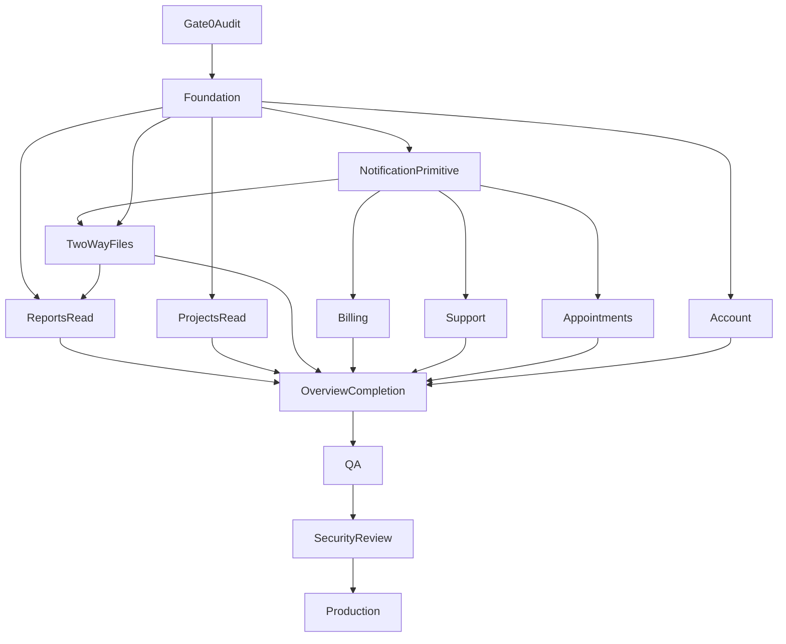

# Dependency Map

What must exist before each portal capability can be built safely.  
Labels: **VERIFIED** for current dependencies that already exist, **RECOMMENDATION** for proposed order, **REQUIRES APPROVAL** where a decision blocks the dependency.

## 1. Foundation Dependencies

**VERIFIED already present.**

- Supabase Auth and `js/pulse-auth.js`
- `profiles`, `clients`, `client_members`
- Helpers `can_access_client` and `user_client_ids`
- Static hosting through `workers/router.js` asset fetch
- `client-portal.html` session gate

**RECOMMENDATION before feature UI.**

- Workspace shell and navigation
- One resolved `client_id` for the session
- Inactive-client sign-out aligned with `isClientPortalEligible`
- Shared query helpers that list safe columns
- Agreement on multi-membership behavior (**REQUIRES APPROVAL** if more than the earliest row will be supported)

No feature module should query with a client id taken from the query string without RLS. RLS is still required even when the id comes from `loadClientContext`.

## 2. Authentication Dependencies

| Later work | Depends on |
| --- | --- |
| Every portal page | `initAuth`, `isClientPortalEligible`, existing login and recovery pages |
| Account password | `updatePassword` and a signed-in session |
| Account email change | Supabase Auth email flow. Not built. **REQUIRES APPROVAL** before promising it |
| Staff file screen | A staff eligibility rule. Admin-only `isAdminPortalEligible` is not enough if employees must send files. **REQUIRES APPROVAL** |

**VERIFIED.** Public signup is not a dependency. The portal does not require it.

## 3. Authorization Dependencies

| Later work | Depends on |
| --- | --- |
| Client reads | `can_access_client` and the table policies already in place |
| Owner-only actions | A decision, then policy changes. Not available now |
| Staff send | `is_staff()` today, preferably `is_staff_for_client` after approval |
| Hiding columns | Explicit selects immediately; views or column split where a direct API read must fail |

## 4. Database Dependencies

| Module | Existing tables | Blocks |
| --- | --- | --- |
| Overview, account | `profiles`, `clients`, `client_members` | None for the current card |
| Reports | `reports` | File download also needs the files visibility fix |
| Projects | `projects`, `project_services`, `services` | Tasks need a visibility decision |
| Files | `files` plus new delivery fields | Client UI and staff send |
| Notifications | `notifications` | Enum or mapping decision when new event names are required |
| Support | None | New tables before UI |
| Appointments | `appointments`, `appointment_attendees` | Scheduling writes need a product decision |
| Billing | None for Stripe ids | Mapping table or column before any status UI |
| Audit | `audit_logs` | A writer for client uploads needs definer or Worker approval |

## 5. RLS Dependencies

Feature work that changes who can read or write must land before the UI that assumes the new rule.

| UI | Policy that must already match the UI |
| --- | --- |
| Published report list | `reports_select` already matches. No policy change required to list reports |
| Report file download | `files_select` and `storage_client_files_select` do not match draft and unsent intent. Change first |
| Project list | `projects_select` already matches a client read of project rows |
| Task list | `tasks_select` is broader than a client-safe list. Change or do not list tasks |
| Client file list | Delivery-aware select required first |
| Client upload | `files_insert` and `storage_client_files_insert` currently forbid it. Change first |
| Staff upload without send | Storage and `files` select must deny clients. Change first |
| Appointment list | `appointments_select` allows the read. Notes are the gap |
| Inbox | `notifications_select` and `notifications_update` already match an inbox |
| Billing status | No policy, because no table. Add table and RLS together |

## 6. Storage Dependencies

**VERIFIED.** Bucket `client-files` exists and is private. Size limit exists. MIME allowlist does not. Policies exist.

**RECOMMENDATION order.**

1. Approve path or prefix for internal versus sent objects.
2. Backfill or classify any existing objects.
3. Change storage select and insert.
4. Then build upload and download UI.
5. MIME allowlist can ship with that policy change after the list is approved.

Download UI depends on storage select allowing the object for that user. Signed URLs are not a substitute for a bad select policy if they are minted with a service role. **RECOMMENDATION.** User-scoped download only.

## 7. Notification Dependencies

**RECOMMENDATION.** The primitive (inbox plus a single insert path) lands before files, report publish notifications, support replies, billing events, and appointment events.

Reports and projects can ship read-only without notifications. Their “new report” and “project update” alerts wait on the primitive.

**VERIFIED.** Password reset does not depend on `notifications`. It uses Supabase Auth email.

**REQUIRES APPROVAL.** Any email fan-out depends on a provider that is not in the repo.

## 8. Stripe Dependencies

```text
Existing checkout catalog and Worker
  -> approval of customer mapping and management UX
    -> stripe customer id stored on the client
      -> signed webhook
        -> status rows the portal can select under RLS
          -> portal billing section
            -> optional Customer Portal session route
```

**VERIFIED.** The portal billing section has no earlier step it can skip. Checkout success in `cart/checkout.js` only returns `complete` and `status` for that session. It does not create a client subscription record.

Public checkout can keep shipping without the portal. The portal must not call Stripe with the secret key.

## 9. Feature Dependencies

| Feature | Must precede it | Can follow it |
| --- | --- | --- |
| Account | Foundation, existing password functions | Email preferences |
| Notification primitive | Foundation | All event producers |
| Reports read | Foundation | File download, publish notification |
| Projects read | Foundation | Task flag, file links |
| Two-way files | Foundation, delivery RLS, storage path, notification primitive for alerts, audit decision | Overview file counts |
| Billing | Stripe approval, mapping, webhook | Overview billing block |
| Support | New tables, notification primitive | Overview support block |
| Appointments read | Foundation, notes decision | Request or reschedule flow |
| Overview completion | The modules whose numbers it shows | — |

## 10. Cross-Module Dependencies

- **Reports and files.** A report download is a client-visible file with `report_id`. Publishing a report does not by itself publish every file that mentions that report until file state says so.
- **Projects and files.** Project pages list files with `project_id` that are client-visible.
- **Projects and tasks.** Task rows are optional and gated on the visibility decision.
- **Files, support, billing, appointments, reports.** Each calls the same notification writer. None owns a private notification table.
- **Account and notifications.** Security events such as password change can insert a notification without a new table.
- **Admin file screen and client files.** They are the two sides of one `files` policy. Building only the client side cannot implement Send to Client.

## 11. Critical Path

**RECOMMENDATION.**

1. Gate 0 accepts this audit.
2. Foundation shell and tenant context.
3. Notification primitive (writer and inbox).
4. Files security model (state, RLS, storage) and the minimal staff send screen together with client list, download, and upload.
5. Reports and projects read models can proceed in parallel with files design, but report download waits on step 4.
6. Billing, support, and appointment scheduling wait on their own approvals. Appointment read can proceed once notes handling is accepted.
7. Overview counts update after each module.
8. QA, security review, production gate.



The reports node appears twice in the sense that metadata can start before files, while download depends on files. The diagram shows download’s dependency by pointing files into reports before overview. Metadata-only report UI does not need to wait for upload. That split is described in the phased plan.

## 12. Parallelizable Work

After foundation and the notification primitive:

- Account UI
- Report metadata UI
- Project metadata UI (without tasks)
- Appointment read UI, if notes handling is accepted
- File policy design (not production migration until Gate 3)

These stay sequential:

- File UI after file RLS and storage rules
- Billing UI after Stripe approval and sync
- Support UI after support tables
- Appointment request or cancel after the scheduler decision
- Production after security review

**VERIFIED.** Research catalog and benchmark work are not on this path and should not be coupled to portal migrations.
